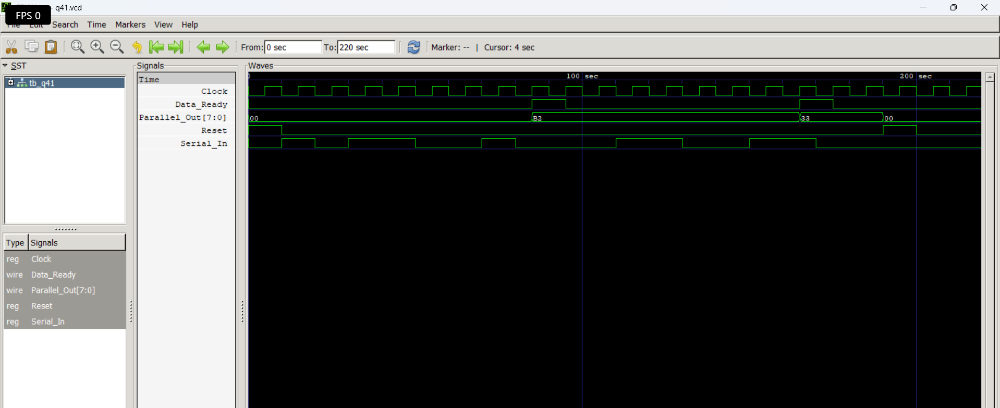

# Level 5 — Finite State Machines (FSM)

> **Part of:** [verilog-questions](../) — Verilog HDL learning from zero to FSM-based project  
> **Tools:** Icarus Verilog · GTKWave · VS Code  
> **Status:** 🔄 In Progress — Day 16 (Q36- Q41 Completed)

---

## What This Level Covers

Introducing **Finite State Machines (FSMs)** — digital circuits capable of remembering previous states and making decisions based on both current inputs and stored state information.

Unlike basic sequential circuits that simply store data, FSMs are **control circuits**. They are used whenever hardware needs to follow a sequence of operations or react differently depending on what happened previously.

DSA equivalent: State transitions, graphs, finite automata, transition tables

Verilog equivalent: State registers, next-state logic, Moore FSMs, Mealy FSMs, state encoding

### Three rules that never change in this level

- Every FSM has a **State Register**
- Every FSM requires **Next-State Logic**
- Every FSM produces outputs using either **Moore** or **Mealy** output logic

---

## Standard FSM Architecture

```
             Inputs
                │
                ▼
    ┌────────────────────────┐
    │   Next-State Logic     │
    │     always @(*)        │
    └──────────┬─────────────┘
               │
          Next State
               │
               ▼
    ┌────────────────────────┐
Clk │    State Register      │
───►│ always @(posedge clk)  │
    └──────────┬─────────────┘
               │
         Current State
               │
               ▼
    ┌────────────────────────┐
    │     Output Logic       │
    │ assign / always @(*)   │
    └──────────┬─────────────┘
               │
             Outputs
```

---

## Progress

| # | File | What It Does | Status |
|---|------|-------------|--------|
| Q36 | `Q36-Two-State-Toggle-FSM.v` | Two-State Toggle Moore FSM | ✅ Done |
| Q37 | `q37_Multi-State FSM.v` | Multi-State FSM | ✅ Done |
| Q38 | `q38_FSM Controller.v` | FSM Controller | ✅ Done |
| Q39 | `Q39-Vending_machine(simple).v` | Vending Machine FSM | ✅ Done |
| Q40 | `q40_Edge_Detector.v` | Edge Detector | ✅ Done |
| Q41 | `Q41-Serial_to_Parallel_Converter.v` | Serial to Parallel Converter  | ✅ Done |
| Q42 | `q42_*.v` | FSM with Datapath  | ⏳ |
| Q43 | `q43_*.v` | Smart Traffic Controller — 4 states + emergency override | ⏳ |
| Q44 | `q44_*.v` | Parking Lot Controller | ⏳ |
| Q45 | `q45_*.v` | UART Transmitter FSM | ⏳ |

---

## How to Run

```bash
iverilog -o output q36.v tb_q36.v
vvp output
gtkwave q36.vcd
```

GTKWave becomes even more important in this level because FSMs continuously change state based on the clock and input conditions.

Useful tips:

- Display current state and next state
- Watch state transitions on every positive clock edge
- Verify reset behavior
- Compare state transitions with your state diagram
- Predict the next state before simulation

---

# 8-bit Serial-to-Parallel Converter

## 📌 Overview

This project implements an **8-bit Serial-to-Parallel Converter** in Verilog HDL. The converter receives one serial bit on every clock cycle, stores the incoming bits in an internal shift register, and transfers the complete 8-bit data to a parallel output after receiving all eight bits.

A **Data_Ready** signal is generated to indicate that a complete byte has been successfully received.

---

## 🎯 Objective

- Convert serial data into parallel data.
- Understand the working of shift registers.
- Implement a bit counter.
- Generate a Data_Ready signal after receiving 8 bits.
- Practice sequential circuit design using Verilog HDL.

---

## 🛠️ Features

- 8-bit Serial Data Reception
- Serial-to-Parallel Conversion
- Shift Register Based Design
- 4-bit Counter
- Parallel Data Output
- Data Ready Pulse Generation
- Asynchronous Reset

---

## 📂 Inputs

| Signal | Width | Description |
|---------|------|-------------|
| Clock | 1 | System Clock |
| Reset | 1 | Asynchronous Reset |
| Serial_In | 1 | Serial Input Data |

---

## 📂 Outputs

| Signal | Width | Description |
|---------|------|-------------|
| Parallel_Out | 8 | Converted Parallel Data |
| Data_Ready | 1 | Indicates that 8 bits have been received |

---

## ⚙️ Working Principle

### Reset

When Reset is asserted:

- Counter is cleared.
- Shift Register is cleared.
- Parallel Output is cleared.
- Data_Ready becomes LOW.

### Normal Operation

On every positive edge of the clock:

1. One serial bit is shifted into the shift register.
2. The counter increments.
3. After receiving 8 bits:
   - The complete byte is transferred to `Parallel_Out`.
   - `Data_Ready` goes HIGH for one clock cycle.
   - Counter resets to receive the next byte.

---

## 🧠 Internal Components

- 8-bit Shift Register
- 4-bit Counter
- Parallel Output Register
- Data Ready Logic

---
#Waveform

> 


---
## 🧪 Test Cases

### Test Case 1
✔ Reset Verification

- All registers reset to zero.

---

### Test Case 2
✔ First Serial Data Reception

Input Bits:

10110010

Expected Output:

Parallel_Out = B2 (Hex)

---

### Test Case 3
✔ Idle Verification

- No incoming serial data.
- Data_Ready returns LOW.

---

### Test Case 4
✔ Second Serial Data Reception

Another 8-bit serial stream was applied to verify continuous operation.

---

### Test Case 5
✔ Reset During Operation

- Reset asserted after data reception.
- All registers successfully cleared.

---

## 📊 Simulation

Simulation Tools:

- Icarus Verilog
- GTKWave

Verified:

- Shift Register Operation
- Counter Operation
- Serial-to-Parallel Conversion
- Data_Ready Pulse
- Reset Functionality

---

## 📚 Concepts Learned

- Shift Registers
- Counters
- Serial-to-Parallel Conversion
- Sequential Logic
- Register Transfer Logic (RTL)
- Non-Blocking Assignments (`<=`)

---

## 🚀 Future Improvements

- Configurable Data Width (8/16/32 bits)
- Enable Signal
- Load Control
- Shift Direction Selection
- Parameterized Design
- Integration with Communication Interfaces (UART/SPI)

---

## 🏁 Conclusion

This project demonstrates the implementation of an **8-bit Serial-to-Parallel Converter** using Verilog HDL. The design converts serial input data into parallel form using a shift register and counter, making it an excellent exercise for understanding sequential digital circuit design and RTL development.

🚀 Author
Yash Gupta

Learning Verilog HDL through structured RTL design, simulation, FSM design, and digital system implementation.