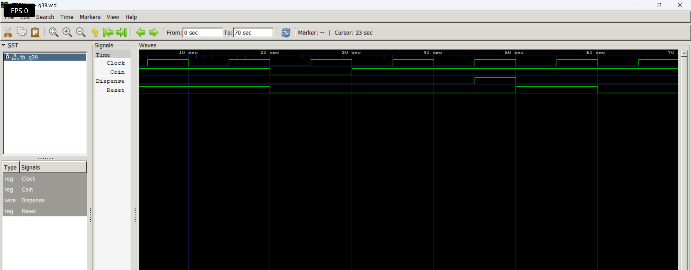

# Level 5 — Finite State Machines (FSM)

> **Part of:** [verilog-questions](../) — Verilog HDL learning from zero to FSM-based project  
> **Tools:** Icarus Verilog · GTKWave · VS Code  
> **Status:** 🔄 In Progress — Day 14 (Q36- Q39 Completed)

---

## What This Level Covers

Introducing **Finite State Machines (FSMs)** — digital circuits capable of remembering previous states and making decisions based on both current inputs and stored state information.

Unlike basic sequential circuits that simply store data, FSMs are **control circuits**. They are used whenever hardware needs to follow a sequence of operations or react differently depending on what happened previously.

DSA equivalent: State transitions, graphs, finite automata, transition tables

Verilog equivalent: State registers, next-state logic, Moore FSMs, Mealy FSMs, state encoding

### Three rules that never change in this level

- Every FSM has a **State Register**
- Every FSM requires **Next-State Logic**
- Every FSM produces outputs using either **Moore** or **Mealy** output logic

---

## Standard FSM Architecture

```
             Inputs
                │
                ▼
    ┌────────────────────────┐
    │   Next-State Logic     │
    │     always @(*)        │
    └──────────┬─────────────┘
               │
          Next State
               │
               ▼
    ┌────────────────────────┐
Clk │    State Register      │
───►│ always @(posedge clk)  │
    └──────────┬─────────────┘
               │
         Current State
               │
               ▼
    ┌────────────────────────┐
    │     Output Logic       │
    │ assign / always @(*)   │
    └──────────┬─────────────┘
               │
             Outputs
```

---

## Progress

| # | File | What It Does | Status |
|---|------|-------------|--------|
| Q36 | `Q36-Two-State-Toggle-FSM.v` | Two-State Toggle Moore FSM | ✅ Done |
| Q37 | `q37_Multi-State FSM.v` | Multi-State FSM | ✅ Done |
| Q38 | `q38_FSM Controller.v` | FSM Controller | ✅ Done |
| Q39 | `Q39-Vending_machine(simple).v` | Vending Machine FSM | ✅ Done |
| Q40 | `q40_*.v` | Edge Detector | ⏳ |
| Q41 | `q41_*.v` | Serial to Parallel Converter  | ⏳ |
| Q42 | `q42_*.v` | FSM with Datapath  | ⏳ |
| Q43 | `q43_*.v` | Smart Traffic Controller — 4 states + emergency override | ⏳ |
| Q44 | `q44_*.v` | Parking Lot Controller | ⏳ |
| Q45 | `q45_*.v` | UART Transmitter FSM | ⏳ |

---

## How to Run

```bash
iverilog -o output q36.v tb_q36.v
vvp output
gtkwave q36.vcd
```

GTKWave becomes even more important in this level because FSMs continuously change state based on the clock and input conditions.

Useful tips:

- Display current state and next state
- Watch state transitions on every positive clock edge
- Verify reset behavior
- Compare state transitions with your state diagram
- Predict the next state before simulation

---

# Q39 - Vending Machine FSM (Moore FSM)

## 📌 Aim

Design a Moore Finite State Machine (FSM) that dispenses an item after receiving two ₹5 coins (₹10 total).

---

## 📖 Theory

A vending machine remembers the total amount inserted using different states.

States used:

- **S0** : ₹0 collected
- **S1** : ₹5 collected
- **S2** : ₹10 collected (Dispense Item)

The machine accepts one ₹5 coin at a time.

Once ₹10 has been collected, the machine enters the dispensing state and then returns to the idle state for the next customer.

Since the output depends only on the current state, this is a **Moore FSM**.

---

## ⚠️ Assumptions

This implementation is a simplified Moore FSM created for learning purposes.

The following assumptions have been made:

- The vending machine accepts **only ₹5 coins**.
- Each `Coin = 1` represents the insertion of **one ₹5 coin**.
- The item costs **₹10**, so two ₹5 coins are required.
- The FSM does **not** support multiple coin denominations (such as ₹10 or ₹20).
- The FSM does **not** detect how many coins are inserted simultaneously; it assumes only one coin can be inserted per clock cycle.
- After dispensing the item, the machine automatically returns to the idle state (S0) and starts a new transaction.

Future versions can be extended to support:
- Multiple coin denominations (₹5, ₹10, ₹20, etc.)
- Change return
- Invalid coin detection
- Multiple item selection
- Balance display

---


## 🛠 Components Used

- State Register
- Next State Logic
- Moore Output Logic
- Asynchronous Reset
- Case Statement

---

## 🗂 State Encoding

| State | Meaning | Binary |
|-------|---------|--------|
| S0 | ₹0 Collected | 2'b00 |
| S1 | ₹5 Collected | 2'b01 |
| S2 | ₹10 Collected / Dispense | 2'b10 |

---

## 🔄 State Transition Table

| Current State | Coin = 0 | Coin = 1 |
|---------------|----------|----------|
| S0 | S0 | S1 |
| S1 | S1 | S2 |
| S2 | S0 | S0 |

---

## 📊 Output Table

| State | Dispense |
|-------|----------|
| S0 | 0 |
| S1 | 0 |
| S2 | 1 |

---

## ▶️ Simulation

The simulation verifies:

- Reset initializes the FSM to S0.
- First coin moves S0 → S1.
- Second coin moves S1 → S2.
- Dispense becomes HIGH in S2.
- FSM returns to S0 after dispensing.

---

## 🌊 Waveform

```md

```
---

## 📚 Concepts Learned

- Moore FSM
- State Register
- Next-State Logic
- Output Logic
- State Encoding
- State Transition Table
- Case Statements
- Asynchronous Reset

---

## 🎯 Applications

- Vending Machines
- Ticket Machines
- Toll Collection Systems
- Payment Controllers
- Token-Based Access Systems

---

## 💡 Key Takeaway

A Moore FSM generates outputs based only on the current state, making the design stable and easier to understand.

---

## 📁 Files

```
q39.v
tb_q39.v
q39.vcd
README.md
```

---

## 🚀 Author

**Yash Gupta**

Learning Verilog HDL through structured RTL design, simulation, and FSM-based digital systems.