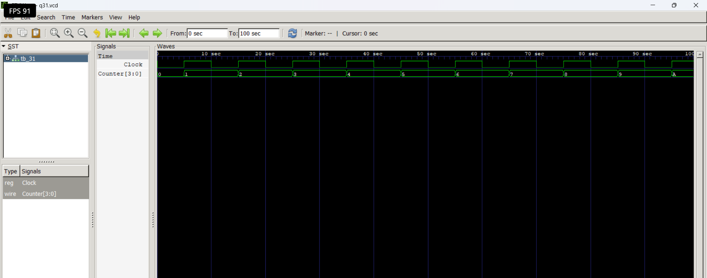

# Level 4 — Sequential Circuits

> **Part of:** [verilog-questions](../) — Verilog HDL learning from zero to FSM-based project  
> **Tools:** Icarus Verilog · GTKWave · VS Code  
> **Status:** 🔄 In Progress — Day 6 (Q26–Q31 done)

---

## What This Level Covers

Introducing **sequential logic** — circuits that can store information and update outputs only on clock edges.

Unlike combinational logic, sequential circuits remember previous values using flip-flops and registers.

DSA equivalent: Variables storing previous state, iterative updates, counters

Verilog equivalent: `always @(posedge clk)`, non-blocking assignments (`<=`), flip-flops, registers, counters, shift registers

### Three rules that never change in this level

- Sequential logic uses `always @(posedge clk)`
- Use non-blocking assignment (`<=`) inside clocked always blocks
- Outputs driven inside clocked always blocks must be declared as `reg`

---

## Progress

| # | File | What It Does | Status |
|---|------|-------------|--------|
| Q26 | `q26_dff.v` | D Flip-Flop | ✅ Done |
| Q27 | `q27_dffsync.v` | D Flip-Flop with Synchronous Reset | ✅ Done |
| Q28 | `q28_dffasync.v` | D Flip-Flop with Asynchronous Reset | ✅ Done |
| Q29 | `q29_register.v` | 4-bit Register | ✅ Done |
| Q30 | `q30_shiftreg.v` | 4-bit Shift Register | ✅ Done |
| Q31 | `q31_upcounter.v` | 4-bit Up Counter | ✅ Done |
| Q32 | `q32_updown.v` | 4-bit Up-Down Counter | ⬜ Not Started |
| Q33 | `q33_decade.v` | Decade Counter | ⬜ Not Started |
| Q34 | `q34_clkdivider.v` | Clock Divider | ⬜ Not Started |
| Q35 | `q35_piso.v` | PISO Shift Register | ⬜ Not Started |

---

## How to Run

```bash
iverilog -o output q26_dff.v tb_q26.v
vvp output
gtkwave q26.vcd
```

GTKWave is essential in this level because sequential circuits depend on **clock timing** rather than only input values.

Useful tips:

- Display multi-bit signals in Binary or Hex
- Observe **posedge clk**
- Compare input and output timing
- Predict waveforms before simulating

---

## Q31 — 4-bit Up Counter

**What it does:**

A 4-bit synchronous up counter increments its value by **1** on every rising edge of the clock. After reaching its maximum value (`1111`), it wraps around to `0000` due to 4-bit overflow.

**Real world use:**

Counters are one of the most widely used sequential circuits. They are used in digital clocks, timers, event counters, traffic light controllers, frequency dividers, processors, and embedded systems.

### Code

```verilog
module q31(
    input wire Clock,
    output reg [3:0] Counter
);

initial
    Counter = 4'b0000;

always @(posedge Clock)
begin
    Counter <= Counter + 4'b0001;
end

endmodule
```

### Example

Initial value:

```
Counter = 0000
```

| Rising Edge | Counter |
|-------------|---------|
| ↑ | 0001 |
| ↑ | 0010 |
| ↑ | 0011 |
| ↑ | 0100 |
| ↑ | 0101 |
| ... | ... |
| ↑ | 1111 |
| ↑ | 0000 |

The counter automatically wraps back to zero after reaching `1111`.

---

### Waveform

```md

```

---

### What I Learned

- A counter is a sequential circuit that updates its own value.
- Unlike registers and shift registers, a counter does not require a data input.
- Non-blocking assignment (`<=`) is used for sequential logic.
- A 4-bit counter can represent values from **0 to 15**.
- When the count exceeds `1111`, overflow occurs and the value wraps around to `0000`.
- Registers without initialization start as `xxxx` in simulation.
- An `initial` block can initialize values for simulation, while real hardware typically uses a reset signal.

---

### Hardware Insight

```
        +----------------------+
Clock ->|     4-bit Counter    |
        |                      |
        | Counter = Counter+1  |
        +----------------------+
                 |
                 ▼
            0000
            0001
            0010
            0011
            0100
             ...
            1111
            0000
```

Each rising edge increases the stored count by one.

---

### Common Beginner Mistakes

- Forgetting to declare the output as `reg`.
- Using blocking assignment (`=`) instead of non-blocking (`<=`).
- Forgetting to initialize the counter, resulting in `xxxx` during simulation.
- Assuming the counter stops at `1111`; instead, it wraps back to `0000`.
- Driving the counter from the testbench instead of letting it count automatically.

## Key Concepts Learned So Far

| Concept | Meaning |
|----------|---------|
| `always @(posedge clk)` | Sequential logic updates on rising clock edge |
| `always @(posedge clk or posedge reset)` | Responds to either clock or reset |
| `<=` | Non-blocking assignment used in sequential logic |
| D Flip-Flop | Stores one bit |
| Clock | Synchronizes digital hardware |
| Synchronous Reset | Reset occurs only on a clock edge |
| Asynchronous Reset | Reset occurs immediately |
| Clock Generator | Generates a periodic clock in the testbench |

---

---

## Level Outcome

After completing these questions, I can:

- Design and simulate D Flip-Flops.
- Generate clocks inside Verilog testbenches.
- Understand the difference between combinational and sequential logic.
- Implement synchronous and asynchronous reset circuits.
- Predict sequential waveforms before simulation.
- Analyze timing behavior using GTKWave.

---

*Updated as questions are completed.*

**Next: Q31 — 4-bit Up-Down Counter**