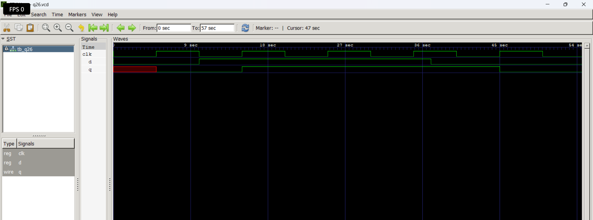

# Level 4 — Sequential Circuits: Flip-Flops and Registers

> **Part of:** [verilog-questions](../) — Verilog HDL learning from zero to FSM-based project  
> **Tools:** Icarus Verilog · GTKWave · VS Code  
> **Status:** 🔄 In Progress — Day 1 (Q26 done)

---

## What This Level Covers

The biggest jump in Verilog learning — from combinational logic that responds instantly to sequential circuits that store state across clock cycles.

DSA equivalent: Stacks and Queues — data that remembers previous state  
Verilog equivalent: Flip-flops and registers — hardware that stores values

**Two rules that never change in this level:**
- Use `always @(posedge clk)` for clocked sequential logic
- Always use non-blocking `<=` inside clocked always blocks — never `=`

---

## Progress

| # | File | What It Does | Status |
|---|------|-------------|--------|
| Q26 | `q26_dff.v` | D Flip-Flop — basic clocked storage | ✅ Done |
| Q27 | `q27_dff_sync.v` | D Flip-Flop with synchronous reset | ⬜ Not Started |
| Q28 | `q28_dff_async.v` | D Flip-Flop with asynchronous reset | ⬜ Not Started |
| Q29 | `q29_register.v` | 4-bit Register | ⬜ Not Started |
| Q30 | `q30_shift.v` | 4-bit Shift Register | ⬜ Not Started |
| Q31 | `q31_counter_up.v` | 4-bit Synchronous Up Counter | ⬜ Not Started |
| Q32 | `q32_counter_updown.v` | 4-bit Up-Down Counter | ⬜ Not Started |
| Q33 | `q33_decade.v` | Decade Counter — 0 to 9 | ⬜ Not Started |
| Q34 | `q34_clkdiv.v` | Clock Divider | ⬜ Not Started |
| Q35 | `q35_piso.v` | 8-bit PISO Shift Register | ⬜ Not Started |

---

## How to Run

```bash
iverilog -o output q26_dff.v q26_dff_tb.v
vvp output
gtkwave dump.vcd
```

GTKWave is essential from this level onwards — you cannot properly verify sequential circuits from terminal output alone. You need to see signals changing over clock cycles visually.

---

## Q26 — D Flip-Flop

**What it does:** Captures the value of input `d` on every rising clock edge and holds it at output `q` until the next rising edge.  
**Real world use:** The fundamental storage element of all digital systems. Registers, memories, pipelines, and state machines are all built from flip-flops.

**Code:**
```verilog
module q26_dff(
    input  clk,
    input  d,
    output reg q
);
    always @(posedge clk) begin
        q <= d;
    end
endmodule
```

**Behaviour:**

| clock edge | d | q (after edge) |
|------------|---|----------------|
| rising     | 0 | 0              |
| rising     | 1 | 1              |
| rising     | 1 | 1              |
| rising     | 0 | 0              |

**Waveform:**



**What I learned:**  
`posedge clk` means the always block only triggers on the rising edge of the clock — not continuously like `always @(*)`. The output `q` only changes at clock edges, not instantly when `d` changes. This is what makes it a storage element — it holds the last value captured at the clock edge. Non-blocking `<=` is used here because in sequential circuits all assignments should update simultaneously at the clock edge, not one after another.

---

## Key Concepts So Far

| Concept | What It Means |
|---------|--------------|
| `always @(posedge clk)` | Triggers only on rising clock edge |
| `<=` non-blocking | All assignments update simultaneously at clock edge |
| `posedge` | Rising edge — 0 to 1 transition |
| `negedge` | Falling edge — 1 to 0 transition |
| Flip-flop | Stores one bit across clock cycles |
| Setup time | Input must be stable before clock edge |

---

## Critical Rule — Blocking vs Non-Blocking

```verilog
// CORRECT — sequential always block
always @(posedge clk) begin
    q <= d;    // non-blocking <= always in clocked blocks
end

// WRONG — never do this in clocked block
always @(posedge clk) begin
    q = d;     // blocking = causes subtle simulation bugs
end
```

---

*Updated as questions are completed*  
*Next: Q27 D Flip-Flop with synchronous reset*  
*Previous: [Level 3 — Combinational Logic](../level3-combinational/README.md)*