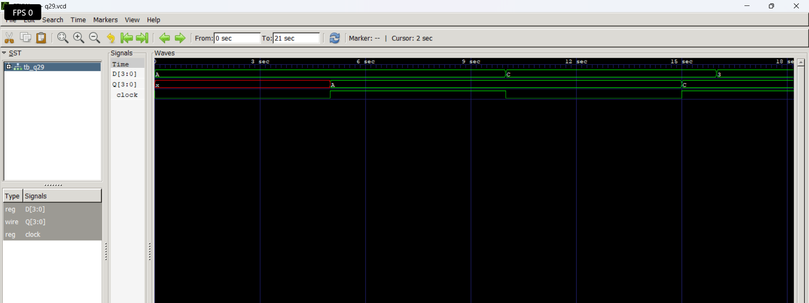

# Level 4 — Sequential Circuits

> **Part of:** [verilog-questions](../) — Verilog HDL learning from zero to FSM-based project  
> **Tools:** Icarus Verilog · GTKWave · VS Code  
> **Status:** 🔄 In Progress — Day 5 (Q26–Q29 done)

---

## What This Level Covers

Introducing **sequential logic** — circuits that can store information and update outputs only on clock edges.

Unlike combinational logic, sequential circuits remember previous values using flip-flops and registers.

DSA equivalent: Variables storing previous state, iterative updates, counters

Verilog equivalent: `always @(posedge clk)`, non-blocking assignments (`<=`), flip-flops, registers, counters, shift registers

### Three rules that never change in this level

- Sequential logic uses `always @(posedge clk)`
- Use non-blocking assignment (`<=`) inside clocked always blocks
- Outputs driven inside clocked always blocks must be declared as `reg`

---

## Progress

| # | File | What It Does | Status |
|---|------|-------------|--------|
| Q26 | `q26_dff.v` | D Flip-Flop | ✅ Done |
| Q27 | `q27_dffsync.v` | D Flip-Flop with Synchronous Reset | ✅ Done |
| Q28 | `q28_dffasync.v` | D Flip-Flop with Asynchronous Reset | ✅ Done |
| Q29 | `q29_register.v` | 4-bit Register | ✅ Done |
| Q30 | `q30_shiftreg.v` | 4-bit Shift Register | ⬜ Not Started |
| Q31 | `q31_upcounter.v` | 4-bit Up Counter | ⬜ Not Started |
| Q32 | `q32_updown.v` | 4-bit Up-Down Counter | ⬜ Not Started |
| Q33 | `q33_decade.v` | Decade Counter | ⬜ Not Started |
| Q34 | `q34_clkdivider.v` | Clock Divider | ⬜ Not Started |
| Q35 | `q35_piso.v` | PISO Shift Register | ⬜ Not Started |

---

## How to Run

```bash
iverilog -o output q26_dff.v tb_q26.v
vvp output
gtkwave q26.vcd
```

GTKWave is essential in this level because sequential circuits depend on **clock timing** rather than only input values.

Useful tips:

- Display multi-bit signals in Binary or Hex
- Observe **posedge clk**
- Compare input and output timing
- Predict waveforms before simulating

---

---

## Q29 — 4-bit Register

**What it does:**

Stores a **4-bit input** and updates the output only on the **rising edge of the clock**. Unlike a single D Flip-Flop, a register stores multiple bits simultaneously.

**Real world use:**

CPU registers, instruction registers, data buffers, temporary storage in processors, memory interfaces, and digital systems where multiple bits must be stored together.

### Code

```verilog
module q29_register(
    input wire [3:0] D,
    input wire clock,
    output reg [3:0] Q
);

always @(posedge clock)
    Q <= D;

endmodule
```

### Examples

| Clock | D | Q |
|------|------|------|
| ↑ | 1010 | 1010 |
| ↑ | 1100 | 1100 |
| No Edge | 0011 | Holds previous value |
| No Edge | 1111 | Holds previous value |

---

**Waveform**

```md

```

---

### What I Learned

- A register is simply a collection of **multiple D Flip-Flops** sharing the same clock.
- A 4-bit register stores all four bits **simultaneously** on the rising edge of the clock.
- Vector assignments allow copying an entire bus using a single statement:

```verilog
Q <= D;
```

instead of assigning each bit individually.

- The output retains its previous value until the next rising clock edge.
- Registers are the fundamental storage elements used throughout digital systems.

---

## Key Concept

```
                 4-bit Register

      D3 ─────► D Flip-Flop ─────► Q3

      D2 ─────► D Flip-Flop ─────► Q2

      D1 ─────► D Flip-Flop ─────► Q1

      D0 ─────► D Flip-Flop ─────► Q0

                     ▲
                     │
                 Same Clock
```

All four flip-flops receive the same clock, so every stored bit updates at exactly the same clock edge.

---

### Common Beginner Mistakes

- Declaring `Q` as `wire` instead of `reg`.
- Forgetting to initialize the clock in the testbench.
- Manually driving the clock inside the `initial` block while also using a clock generator.
- Forgetting that the register updates **only** on the rising edge.
- Assigning individual bits unnecessarily instead of using vector assignment (`Q <= D;`).

---

## Key Concepts Learned So Far

| Concept | Meaning |
|----------|---------|
| `always @(posedge clk)` | Sequential logic updates on rising clock edge |
| `always @(posedge clk or posedge reset)` | Responds to either clock or reset |
| `<=` | Non-blocking assignment used in sequential logic |
| D Flip-Flop | Stores one bit |
| Clock | Synchronizes digital hardware |
| Synchronous Reset | Reset occurs only on a clock edge |
| Asynchronous Reset | Reset occurs immediately |
| Clock Generator | Generates a periodic clock in the testbench |

---

## Common Beginner Mistakes

- Using `=` instead of `<=` inside sequential logic
- Using `assign` inside an `always` block
- Forgetting to initialize the clock
- Driving the clock manually instead of using a clock generator
- Using `=` instead of `==` inside `if` conditions
- Forgetting that asynchronous reset requires `posedge reset` in the sensitivity list

---

## Level Outcome

After completing these questions, I can:

- Design and simulate D Flip-Flops.
- Generate clocks inside Verilog testbenches.
- Understand the difference between combinational and sequential logic.
- Implement synchronous and asynchronous reset circuits.
- Predict sequential waveforms before simulation.
- Analyze timing behavior using GTKWave.

---

*Updated as questions are completed.*

*Next: Q30 — 4-bit Shift Register**