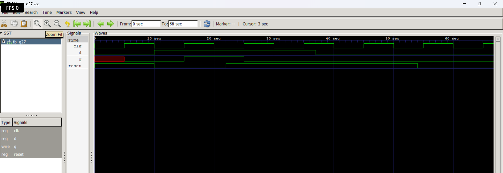

# Level 4 — Sequential Circuits: Flip-Flops and Registers

> **Part of:** [verilog-questions](../) — Verilog HDL learning from zero to FSM-based project  
> **Tools:** Icarus Verilog · GTKWave · VS Code  
> **Status:** 🔄 In Progress — Day 2 (Q26-Q27 done)

---

## What This Level Covers

The biggest jump in Verilog learning — from combinational logic that responds instantly to sequential circuits that store state across clock cycles.

DSA equivalent: Stacks and Queues — data that remembers previous state  
Verilog equivalent: Flip-flops and registers — hardware that stores values

**Two rules that never change in this level:**
- Use `always @(posedge clk)` for clocked sequential logic
- Always use non-blocking `<=` inside clocked always blocks — never `=`

---

## Progress

| # | File | What It Does | Status |
|---|------|-------------|--------|
| Q26 | `q26_dff.v` | D Flip-Flop — basic clocked storage | ✅ Done |
| Q27 | `q27_dff_sync.v` | D Flip-Flop with synchronous reset | ✅ Done |
| Q28 | `q28_dff_async.v` | D Flip-Flop with asynchronous reset | ⬜ Not Started |
| Q29 | `q29_register.v` | 4-bit Register | ⬜ Not Started |
| Q30 | `q30_shift.v` | 4-bit Shift Register | ⬜ Not Started |
| Q31 | `q31_counter_up.v` | 4-bit Synchronous Up Counter | ⬜ Not Started |
| Q32 | `q32_counter_updown.v` | 4-bit Up-Down Counter | ⬜ Not Started |
| Q33 | `q33_decade.v` | Decade Counter — 0 to 9 | ⬜ Not Started |
| Q34 | `q34_clkdiv.v` | Clock Divider | ⬜ Not Started |
| Q35 | `q35_piso.v` | 8-bit PISO Shift Register | ⬜ Not Started |

---

## How to Run

```bash
iverilog -o output q26_dff.v q26_dff_tb.v
vvp output
gtkwave dump.vcd
```

GTKWave is essential from this level onwards — you cannot properly verify sequential circuits from terminal output alone. You need to see signals changing over clock cycles visually.

---

## Q27 — D Flip-Flop with Synchronous Reset

**What it does:**  
Stores one bit like a normal D Flip-Flop, but when **reset is HIGH**, the output becomes `0` on the **next rising edge of the clock**.

**Real world use:**  
Initializing registers during system startup, clearing processor registers, and resetting sequential logic safely.

### Code

```verilog
module q27_dffsync(
    input wire clk,
    input wire d,
    input wire reset,
    output reg q
);

always @(posedge clk) begin
    if(reset)
        q <= 1'b0;
    else
        q <= d;
end

endmodule
```

### Examples

| Reset | Clock | D | Q |
|--------|-------|---|---|
| 1 | ↑ | 1 | 0 |
| 1 | ↑ | 0 | 0 |
| 0 | ↑ | 1 | 1 |
| 0 | ↑ | 0 | 0 |
| 1 | No Edge | X | Holds previous value |

---

**Waveform:**




### What I Learned

- A **synchronous reset** is checked only at the **rising edge** of the clock.
- Reset has **higher priority** than the data input.
- Even if `reset` becomes HIGH, the output does **not** change immediately.
- The flip-flop waits for the next clock edge before resetting.
- Sequential testbenches require an automatically generated clock using:


---

## Key Concepts Learned So Far

| Concept | What It Means |
|----------|---------------|
| `posedge clk` | Executes only on the rising edge of the clock |
| D Flip-Flop | Stores one bit of data |
| Non-blocking (`<=`) | Used for sequential logic |
| Clock | Synchronizes all sequential hardware |
| Synchronous Reset | Reset is checked only on the clock edge |
| Clock Generator | Generates a continuous clock in the testbench |


---

## Critical Rule — Blocking vs Non-Blocking

```verilog
// CORRECT — sequential always block
always @(posedge clk) begin
    q <= d;    // non-blocking <= always in clocked blocks
end

// WRONG — never do this in clocked block
always @(posedge clk) begin
    q = d;     // blocking = causes subtle simulation bugs
end
```

---

*Updated as questions are completed*  
*Next: Q28 D Flip-Flop with asynchronous reset*  