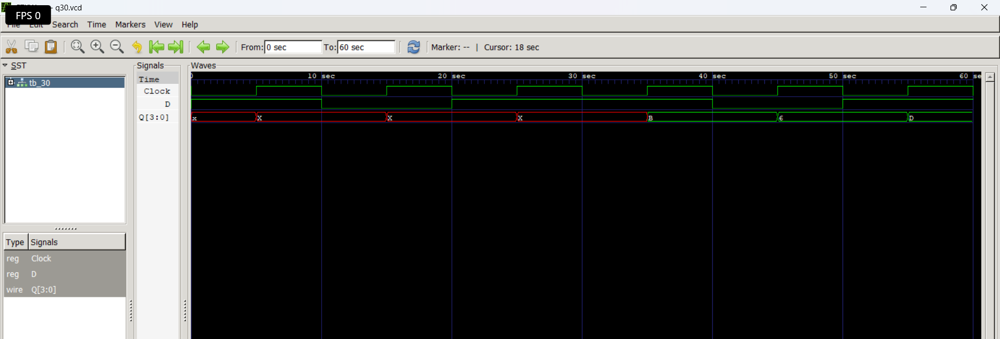

# Level 4 — Sequential Circuits

> **Part of:** [verilog-questions](../) — Verilog HDL learning from zero to FSM-based project  
> **Tools:** Icarus Verilog · GTKWave · VS Code  
> **Status:** 🔄 In Progress — Day 5 (Q26–Q30 done)

---

## What This Level Covers

Introducing **sequential logic** — circuits that can store information and update outputs only on clock edges.

Unlike combinational logic, sequential circuits remember previous values using flip-flops and registers.

DSA equivalent: Variables storing previous state, iterative updates, counters

Verilog equivalent: `always @(posedge clk)`, non-blocking assignments (`<=`), flip-flops, registers, counters, shift registers

### Three rules that never change in this level

- Sequential logic uses `always @(posedge clk)`
- Use non-blocking assignment (`<=`) inside clocked always blocks
- Outputs driven inside clocked always blocks must be declared as `reg`

---

## Progress

| # | File | What It Does | Status |
|---|------|-------------|--------|
| Q26 | `q26_dff.v` | D Flip-Flop | ✅ Done |
| Q27 | `q27_dffsync.v` | D Flip-Flop with Synchronous Reset | ✅ Done |
| Q28 | `q28_dffasync.v` | D Flip-Flop with Asynchronous Reset | ✅ Done |
| Q29 | `q29_register.v` | 4-bit Register | ✅ Done |
| Q30 | `q30_shiftreg.v` | 4-bit Shift Register | ✅ Done |
| Q31 | `q31_upcounter.v` | 4-bit Up Counter | ⬜ Not Started |
| Q32 | `q32_updown.v` | 4-bit Up-Down Counter | ⬜ Not Started |
| Q33 | `q33_decade.v` | Decade Counter | ⬜ Not Started |
| Q34 | `q34_clkdivider.v` | Clock Divider | ⬜ Not Started |
| Q35 | `q35_piso.v` | PISO Shift Register | ⬜ Not Started |

---

## How to Run

```bash
iverilog -o output q26_dff.v tb_q26.v
vvp output
gtkwave q26.vcd
```

GTKWave is essential in this level because sequential circuits depend on **clock timing** rather than only input values.

Useful tips:

- Display multi-bit signals in Binary or Hex
- Observe **posedge clk**
- Compare input and output timing
- Predict waveforms before simulating

---

---

## Q30 — 4-bit Shift Register

**What it does:**

Stores a 4-bit value and shifts all bits **one position to the left** on every rising edge of the clock. The new serial input bit enters at the Least Significant Bit (LSB), while the Most Significant Bit (MSB) is discarded.

**Real world use:**

Shift registers are widely used in serial communication (UART, SPI, I²C), LED running patterns, digital displays, data buffering, serialization/deserialization, and digital signal processing.

### Code

```verilog
module q30_shiftregister(
    input wire D,
    input wire Clock,
    output reg [3:0] Q
);

always @(posedge Clock)
begin
    Q <= {Q[2:0], D};
end

endmodule
```

### Example

Assume the register initially contains:

```
Q = 0000
```

| Clock Edge | D | New Q |
|------------|---|--------|
| ↑ | 1 | 0001 |
| ↑ | 1 | 0011 |
| ↑ | 0 | 0110 |
| ↑ | 1 | 1101 |
| ↑ | 0 | 1010 |

---

**Waveform**

```md

```

---

### What I Learned

- A shift register is built using multiple D Flip-Flops connected in series.
- On every rising edge, all stored bits move one position to the left.
- The newest serial input enters at the Least Significant Bit (LSB).
- Concatenation (`{}`) provides a clean way to shift data.

Instead of writing:

```verilog
Q[3] <= Q[2];
Q[2] <= Q[1];
Q[1] <= Q[0];
Q[0] <= D;
```

Verilog allows the same operation using:

```verilog
Q <= {Q[2:0], D};
```

This makes the code shorter, cleaner, and easier to understand.

---

## Hardware Insight

```
           +----+     +----+     +----+     +----+
D -------> | FF | --> | FF | --> | FF | --> | FF |
           +----+     +----+     +----+     +----+
              |           |           |           |
             Q0          Q1          Q2          Q3
```

Each clock pulse shifts the stored data by one position.

---

### Common Beginner Mistakes

- Forgetting to use non-blocking assignment (`<=`).
- Using `Q <= {Q, D};` (creates a 5-bit value instead of 4 bits).
- Using `Q[3:1]` instead of `Q[2:0]`.
- Forgetting that shifting happens **only** on the rising edge of the clock.
- Forgetting delays (`#`) in the testbench, causing all input changes to occur at simulation time 0.

## Key Concepts Learned So Far

| Concept | Meaning |
|----------|---------|
| `always @(posedge clk)` | Sequential logic updates on rising clock edge |
| `always @(posedge clk or posedge reset)` | Responds to either clock or reset |
| `<=` | Non-blocking assignment used in sequential logic |
| D Flip-Flop | Stores one bit |
| Clock | Synchronizes digital hardware |
| Synchronous Reset | Reset occurs only on a clock edge |
| Asynchronous Reset | Reset occurs immediately |
| Clock Generator | Generates a periodic clock in the testbench |

---

---

## Level Outcome

After completing these questions, I can:

- Design and simulate D Flip-Flops.
- Generate clocks inside Verilog testbenches.
- Understand the difference between combinational and sequential logic.
- Implement synchronous and asynchronous reset circuits.
- Predict sequential waveforms before simulation.
- Analyze timing behavior using GTKWave.

---

*Updated as questions are completed.*

**Next: Q31 — 4-bit Up Counter**