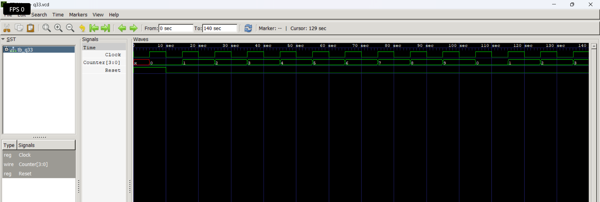

# Level 4 — Sequential Circuits

> **Part of:** [verilog-questions](../) — Verilog HDL learning from zero to FSM-based project  
> **Tools:** Icarus Verilog · GTKWave · VS Code  
> **Status:** 🔄 In Progress — Day 8 (Q26–Q33 done)

---

## What This Level Covers

Introducing **sequential logic** — circuits that can store information and update outputs only on clock edges.

Unlike combinational logic, sequential circuits remember previous values using flip-flops and registers.

DSA equivalent: Variables storing previous state, iterative updates, counters

Verilog equivalent: `always @(posedge clk)`, non-blocking assignments (`<=`), flip-flops, registers, counters, shift registers

### Three rules that never change in this level

- Sequential logic uses `always @(posedge clk)`
- Use non-blocking assignment (`<=`) inside clocked always blocks
- Outputs driven inside clocked always blocks must be declared as `reg`

---

## Progress

| # | File | What It Does | Status |
|---|------|-------------|--------|
| Q26 | `q26_dff.v` | D Flip-Flop | ✅ Done |
| Q27 | `q27_dffsync.v` | D Flip-Flop with Synchronous Reset | ✅ Done |
| Q28 | `q28_dffasync.v` | D Flip-Flop with Asynchronous Reset | ✅ Done |
| Q29 | `q29_register.v` | 4-bit Register | ✅ Done |
| Q30 | `q30_shiftreg.v` | 4-bit Shift Register | ✅ Done |
| Q31 | `q31_upcounter.v` | 4-bit Up Counter | ✅ Done |
| Q32 | `q32_updowncounter.v` | 4-bit Up-Down Counter | ✅ Done |
| Q33 | `q33_decade.v` | Decade Counter | ✅ Done |
| Q34 | `q34_clkdivider.v` | Clock Divider | ⬜ Not Started |
| Q35 | `q35_piso.v` | PISO Shift Register | ⬜ Not Started |

---

## How to Run

```bash
iverilog -o output q26_dff.v tb_q26.v
vvp output
gtkwave q26.vcd
```

GTKWave is essential in this level because sequential circuits depend on **clock timing** rather than only input values.

Useful tips:

- Display multi-bit signals in Binary or Hex
- Observe **posedge clk**
- Compare input and output timing
- Predict waveforms before simulating

---

---

## Q33 — 4-bit Decade (MOD-10) Counter

**What it does:**

A Decade Counter (also called a MOD-10 Counter) counts from **0 to 9** in binary. After reaching `1001` (decimal 9), it resets back to `0000` on the next rising edge of the clock. A synchronous reset initializes the counter to `0000`.

- `Reset = 1` → Counter resets to `0000`
- `Reset = 0` → Counter increments every rising edge
- After `1001` → Counter wraps back to `0000`

---

### Real World Applications

Decade counters are widely used in:

- Digital clocks
- Stopwatches
- Seven-segment display drivers
- Electronic scoreboards
- Frequency counters
- Event counters
- Digital measurement instruments

---

### Code

```verilog
module q33(
    input wire Reset,
    input wire Clock,
    output reg [3:0] Counter
);

always @(posedge Clock)
begin
    if (Reset)
        Counter <= 4'b0000;
    else if (Counter == 4'b1001)
        Counter <= 4'b0000;
    else
        Counter <= Counter + 1;
end

endmodule
```

---

### Counting Sequence

| Decimal | Binary |
|:------:|:------:|
| 0 | 0000 |
| 1 | 0001 |
| 2 | 0010 |
| 3 | 0011 |
| 4 | 0100 |
| 5 | 0101 |
| 6 | 0110 |
| 7 | 0111 |
| 8 | 1000 |
| 9 | 1001 |
| Next | 0000 |

---

### Example Waveform

```
Clock ↑

0000
 ↓
0001
 ↓
0010
 ↓
0011
 ↓
0100
 ↓
0101
 ↓
0110
 ↓
0111
 ↓
1000
 ↓
1001
 ↓
0000
 ↓
0001
```

---

### Waveform

```md

```

---

### What I Learned

- A Decade Counter is also called a **MOD-10 Counter**.
- It counts only **10 states (0–9)**.
- A comparator checks whether the counter has reached `1001`.
- After reaching `9`, the counter resets to `0000`.
- Synchronous reset has the highest priority.
- Sequential logic can combine arithmetic and decision-making.

---

### Hardware Insight

```
                 +----------------------+
Clock ---------->|                      |
Reset ---------->|                      |
                 |   Comparator (==9)   |
                 |          │           |
                 |          ▼           |
                 |   Increment or Reset |
                 |          │           |
                 |      4-bit Register  |
                 +----------------------+
                            │
                            ▼
                         Counter
```

---

### Flowchart

```
Clock ↑
   │
   ▼
Reset?
 │
 ├── Yes → Counter = 0000
 │
 └── No
      │
      ▼
Counter == 9 ?
 │
 ├── Yes → Counter = 0000
 │
 └── No → Counter = Counter + 1
```

---

### Truth Table

| Reset | Counter = 9 | Next Counter |
|:----:|:-----------:|:------------:|
| 1 | X | 0000 |
| 0 | Yes | 0000 |
| 0 | No | Counter + 1 |

---

### Common Beginner Mistakes

- Forgetting to compare with `1001` (decimal 9).
- Allowing the counter to continue to `1010` (decimal 10).
- Forgetting that reset has higher priority than counting.
- Using blocking assignment (`=`) instead of non-blocking (`<=`) in sequential logic.
- Not running the simulation long enough to observe the wrap from `9` back to `0`.

---

### Key Concepts

- Sequential Logic
- MOD-10 Counter
- Decade Counter
- Binary Counting
- Comparator
- Register Feedback
- Synchronous Reset
- Non-blocking Assignment (`<=`)

---

## Level Outcome

After completing these questions, I can:

- Design and simulate D Flip-Flops.
- Generate clocks inside Verilog testbenches.
- Understand the difference between combinational and sequential logic.
- Implement synchronous and asynchronous reset circuits.
- Predict sequential waveforms before simulation.
- Analyze timing behavior using GTKWave.

---

*Updated as questions are completed.*

**Next: Q32 — Clock Divider**