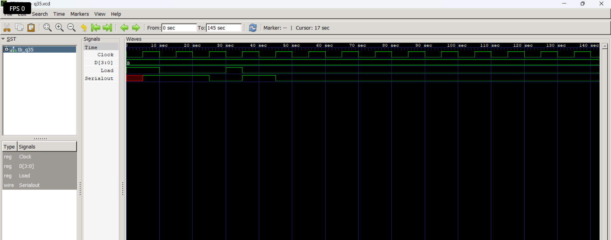

# Level 4 — Sequential Circuits

> **Part of:** [verilog-questions](../) — Verilog HDL learning from zero to FSM-based project  
> **Tools:** Icarus Verilog · GTKWave · VS Code  
> **Status:** 🔄 In Progress — Day 10 (Level 4 done)

---

## What This Level Covers

Introducing **sequential logic** — circuits that can store information and update outputs only on clock edges.

Unlike combinational logic, sequential circuits remember previous values using flip-flops and registers.

DSA equivalent: Variables storing previous state, iterative updates, counters

Verilog equivalent: `always @(posedge clk)`, non-blocking assignments (`<=`), flip-flops, registers, counters, shift registers

### Three rules that never change in this level

- Sequential logic uses `always @(posedge clk)`
- Use non-blocking assignment (`<=`) inside clocked always blocks
- Outputs driven inside clocked always blocks must be declared as `reg`

---

## Progress

| # | File | What It Does | Status |
|---|------|-------------|--------|
| Q26 | `q26_dff.v` | D Flip-Flop | ✅ Done |
| Q27 | `q27_dffsync.v` | D Flip-Flop with Synchronous Reset | ✅ Done |
| Q28 | `q28_dffasync.v` | D Flip-Flop with Asynchronous Reset | ✅ Done |
| Q29 | `q29_register.v` | 4-bit Register | ✅ Done |
| Q30 | `q30_shiftreg.v` | 4-bit Shift Register | ✅ Done |
| Q31 | `q31_upcounter.v` | 4-bit Up Counter | ✅ Done |
| Q32 | `q32_updowncounter.v` | 4-bit Up-Down Counter | ✅ Done |
| Q33 | `q33_decade.v` | Decade Counter | ✅ Done |
| Q34 | `q34_clkdivider.v` | Clock Divider | ✅ Done |
| Q35 | `q35_piso.v` | PISO Shift Register | ✅ Done |

---

## How to Run

```bash
iverilog -o output q26_dff.v tb_q26.v
vvp output
gtkwave q26.vcd
```

GTKWave is essential in this level because sequential circuits depend on **clock timing** rather than only input values.

Useful tips:

- Display multi-bit signals in Binary or Hex
- Observe **posedge clk**
- Compare input and output timing
- Predict waveforms before simulating

---

---

# Q35 - Parallel-In Serial-Out (PISO) Shift Register

## 📌 Aim

Design a **4-bit Parallel-In Serial-Out (PISO) Shift Register** in Verilog HDL that loads 4-bit parallel data and shifts it out serially on every rising edge of the clock.

---

## 📖 Theory

A **Parallel-In Serial-Out (PISO) Shift Register** is a sequential circuit used to convert parallel data into serial data.

It operates in two modes:

### 1. Load Mode (`Load = 1`)
- The entire 4-bit input (`D`) is loaded into the register simultaneously on the rising edge of the clock.

### 2. Shift Mode (`Load = 0`)
- The register shifts one bit to the right on every rising clock edge.
- A `0` is inserted into the most significant bit (MSB).
- The least significant bit (LSB) appears at the serial output.

---

## 🛠️ Components Used

- 4-bit Register
- D Flip-Flops
- Sequential Always Block
- Shift Logic
- Parallel Load Logic
- Continuous Assignment

---

## 💻 Verilog Code

```verilog
module q35 (
    input wire Clock,
    input wire Load,
    input wire [3:0] D,
    output wire Serialout
);

reg [3:0] Register;

always @(posedge Clock) begin
    if (Load)
        Register <= D;
    else
        Register <= {1'b0, Register[3:1]};
end

assign Serialout = Register[0];

endmodule
```

---

## ▶️ Simulation

The simulation verifies that:

- Parallel data is loaded correctly.
- Register shifts right after loading.
- Serial output produces one bit every clock cycle.
- A zero is inserted into the MSB after every shift.

---

## 🌊 Waveform

> 

Example:

```
Load = 1

D = 1011

↓

Register = 1011

↓

Clock ↑

Serial Output

1 → 1 → 0 → 1
```

---

## 📚 Concepts Learned

- Parallel Loading
- Serial Data Transmission
- Shift Registers
- Sequential Logic
- Register Operations
- Bit Manipulation
- Continuous Assignment
- Data Conversion (Parallel → Serial)

---

## 🎯 Applications

- UART Communication
- SPI Interfaces
- Data Serialization
- Digital Communication Systems
- Embedded Systems
- FPGA and ASIC Designs

---

## 💡 Key Takeaway

A PISO Shift Register converts parallel data into serial data by loading all bits simultaneously and then shifting them out one bit per clock cycle.

---

## 📁 Files

```
q35.v
tb_q35.v
q35.vcd
README.md
```

---

## 🚀 Author

**Yash Gupta**

Learning Verilog HDL from scratch through hands-on digital design projects.