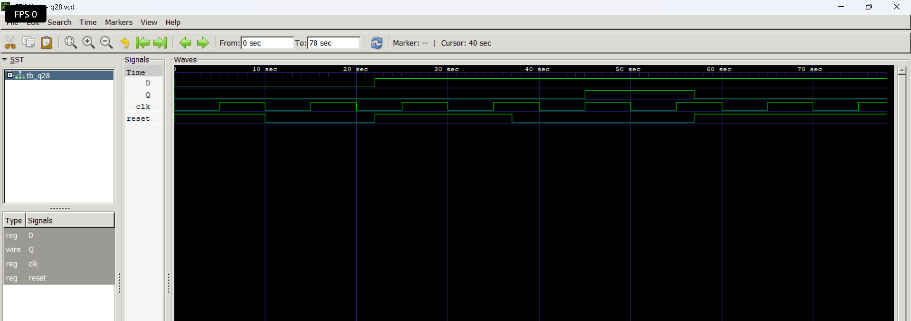

# Level 4 — Sequential Circuits

> **Part of:** [verilog-questions](../) — Verilog HDL learning from zero to FSM-based project  
> **Tools:** Icarus Verilog · GTKWave · VS Code  
> **Status:** 🔄 In Progress — Day 4 (Q26–Q28 done)

---

## What This Level Covers

Introducing **sequential logic** — circuits that can store information and update outputs only on clock edges.

Unlike combinational logic, sequential circuits remember previous values using flip-flops and registers.

DSA equivalent: Variables storing previous state, iterative updates, counters

Verilog equivalent: `always @(posedge clk)`, non-blocking assignments (`<=`), flip-flops, registers, counters, shift registers

### Three rules that never change in this level

- Sequential logic uses `always @(posedge clk)`
- Use non-blocking assignment (`<=`) inside clocked always blocks
- Outputs driven inside clocked always blocks must be declared as `reg`

---

## Progress

| # | File | What It Does | Status |
|---|------|-------------|--------|
| Q26 | `q26_dff.v` | D Flip-Flop | ✅ Done |
| Q27 | `q27_dffsync.v` | D Flip-Flop with Synchronous Reset | ✅ Done |
| Q28 | `q28_dffasync.v` | D Flip-Flop with Asynchronous Reset | ✅ Done |
| Q29 | `q29_register.v` | 4-bit Register | ⬜ Not Started |
| Q30 | `q30_shiftreg.v` | 4-bit Shift Register | ⬜ Not Started |
| Q31 | `q31_upcounter.v` | 4-bit Up Counter | ⬜ Not Started |
| Q32 | `q32_updown.v` | 4-bit Up-Down Counter | ⬜ Not Started |
| Q33 | `q33_decade.v` | Decade Counter | ⬜ Not Started |
| Q34 | `q34_clkdivider.v` | Clock Divider | ⬜ Not Started |
| Q35 | `q35_piso.v` | PISO Shift Register | ⬜ Not Started |

---

## How to Run

```bash
iverilog -o output q26_dff.v tb_q26.v
vvp output
gtkwave q26.vcd
```

GTKWave is essential in this level because sequential circuits depend on **clock timing** rather than only input values.

Useful tips:

- Display multi-bit signals in Binary or Hex
- Observe **posedge clk**
- Compare input and output timing
- Predict waveforms before simulating

---

## Q26 — D Flip-Flop

**What it does:**

Stores a single bit and updates the output only on the **rising edge** of the clock.

**Real world use:**

Registers, CPU pipelines, memories, FSM state storage and digital storage elements.

### Code

```verilog
module q26_dff(
    input wire clk,
    input wire d,
    output reg q
);

always @(posedge clk)
    q <= d;

endmodule
```

### Examples

| Clock | D | Q |
|------|---|---|
| ↑ | 0 | 0 |
| ↑ | 1 | 1 |
| No Edge | 0 | Holds previous value |
| No Edge | 1 | Holds previous value |

---

**Waveform**

```md

```

### What I Learned

- A D Flip-Flop stores one bit.
- Output changes only on the rising edge.
- Sequential circuits require non-blocking assignments (`<=`).
- Testbenches need an automatically generated clock.

---

## Q27 — D Flip-Flop with Synchronous Reset

**What it does:**

Stores one bit like a normal D Flip-Flop but clears the output on the **next rising edge** whenever reset is HIGH.

**Real world use:**

Processor reset logic, register initialization and synchronous digital systems.

### Code

```verilog
module q27_dffsync(
    input wire clk,
    input wire d,
    input wire reset,
    output reg q
);

always @(posedge clk) begin
    if(reset)
        q <= 1'b0;
    else
        q <= d;
end

endmodule
```

### Examples

| Reset | Clock | D | Q |
|------|------|---|---|
| 1 | ↑ | 1 | 0 |
| 1 | ↑ | 0 | 0 |
| 0 | ↑ | 1 | 1 |
| 0 | ↑ | 0 | 0 |
| 1 | No Edge | X | Holds previous value |

---

**Waveform**

```md

```

### What I Learned

- Reset is checked **only at the rising edge**.
- Reset has higher priority than data.
- The output does **not** change immediately when reset becomes HIGH.
- The flip-flop waits for the next clock edge.

---

## Q28 — D Flip-Flop with Asynchronous Reset

**What it does:**

Stores one bit like a normal D Flip-Flop but resets the output **immediately** whenever reset becomes HIGH, without waiting for a clock edge.

**Real world use:**

Power-on reset circuits, emergency shutdown logic, FPGA/ASIC initialization and watchdog reset systems.

### Code

```verilog
module q28_dffasync(
    input wire clk,
    input wire d,
    input wire reset,
    output reg q
);

always @(posedge clk or posedge reset) begin
    if(reset)
        q <= 1'b0;
    else
        q <= d;
end

endmodule
```

### Examples

| Reset | Clock | D | Q |
|------|------|---|---|
| 1 | No Edge | X | 0 immediately |
| 1 | ↑ | X | 0 |
| 0 | ↑ | 1 | 1 |
| 0 | ↑ | 0 | 0 |

---

**Waveform**

```md

```

### What I Learned

- Asynchronous reset acts immediately.
- The sensitivity list includes both the clock and reset.
- The flip-flop does **not** wait for a clock edge to reset.
- The logic inside the always block is almost identical to synchronous reset—the sensitivity list changes the behavior.
- Asynchronous reset is commonly used for power-on initialization and emergency reset circuits.

---

## Key Concepts Learned So Far

| Concept | Meaning |
|----------|---------|
| `always @(posedge clk)` | Sequential logic updates on rising clock edge |
| `always @(posedge clk or posedge reset)` | Responds to either clock or reset |
| `<=` | Non-blocking assignment used in sequential logic |
| D Flip-Flop | Stores one bit |
| Clock | Synchronizes digital hardware |
| Synchronous Reset | Reset occurs only on a clock edge |
| Asynchronous Reset | Reset occurs immediately |
| Clock Generator | Generates a periodic clock in the testbench |

---

## Common Beginner Mistakes

- Using `=` instead of `<=` inside sequential logic
- Using `assign` inside an `always` block
- Forgetting to initialize the clock
- Driving the clock manually instead of using a clock generator
- Using `=` instead of `==` inside `if` conditions
- Forgetting that asynchronous reset requires `posedge reset` in the sensitivity list

---

## Level Outcome

After completing these questions, I can:

- Design and simulate D Flip-Flops.
- Generate clocks inside Verilog testbenches.
- Understand the difference between combinational and sequential logic.
- Implement synchronous and asynchronous reset circuits.
- Predict sequential waveforms before simulation.
- Analyze timing behavior using GTKWave.

---

*Updated as questions are completed.*

*Next: Q29 — 4-bit Register*