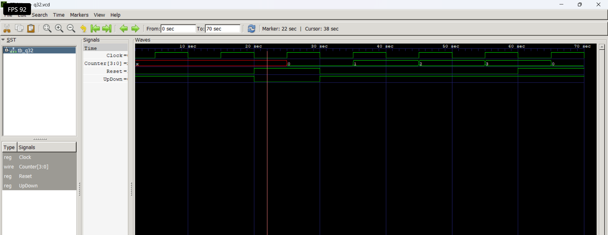

# Level 4 — Sequential Circuits

> **Part of:** [verilog-questions](../) — Verilog HDL learning from zero to FSM-based project  
> **Tools:** Icarus Verilog · GTKWave · VS Code  
> **Status:** 🔄 In Progress — Day 7 (Q26–Q32 done)

---

## What This Level Covers

Introducing **sequential logic** — circuits that can store information and update outputs only on clock edges.

Unlike combinational logic, sequential circuits remember previous values using flip-flops and registers.

DSA equivalent: Variables storing previous state, iterative updates, counters

Verilog equivalent: `always @(posedge clk)`, non-blocking assignments (`<=`), flip-flops, registers, counters, shift registers

### Three rules that never change in this level

- Sequential logic uses `always @(posedge clk)`
- Use non-blocking assignment (`<=`) inside clocked always blocks
- Outputs driven inside clocked always blocks must be declared as `reg`

---

## Progress

| # | File | What It Does | Status |
|---|------|-------------|--------|
| Q26 | `q26_dff.v` | D Flip-Flop | ✅ Done |
| Q27 | `q27_dffsync.v` | D Flip-Flop with Synchronous Reset | ✅ Done |
| Q28 | `q28_dffasync.v` | D Flip-Flop with Asynchronous Reset | ✅ Done |
| Q29 | `q29_register.v` | 4-bit Register | ✅ Done |
| Q30 | `q30_shiftreg.v` | 4-bit Shift Register | ✅ Done |
| Q31 | `q31_upcounter.v` | 4-bit Up Counter | ✅ Done |
| Q32 | `q32_updowncounter.v` | 4-bit Up-Down Counter | ✅ Done |
| Q33 | `q33_decade.v` | Decade Counter | ⬜ Not Started |
| Q34 | `q34_clkdivider.v` | Clock Divider | ⬜ Not Started |
| Q35 | `q35_piso.v` | PISO Shift Register | ⬜ Not Started |

---

## How to Run

```bash
iverilog -o output q26_dff.v tb_q26.v
vvp output
gtkwave q26.vcd
```

GTKWave is essential in this level because sequential circuits depend on **clock timing** rather than only input values.

Useful tips:

- Display multi-bit signals in Binary or Hex
- Observe **posedge clk**
- Compare input and output timing
- Predict waveforms before simulating

---

---

## Q32 — 4-bit Up/Down Counter

**What it does:**

A 4-bit synchronous Up/Down Counter increments or decrements its value on every rising edge of the clock depending on the `UpDown` control signal. A synchronous reset initializes the counter to `0000`.

- `Reset = 1` → Counter resets to `0000`
- `Reset = 0` and `UpDown = 1` → Counter counts up
- `Reset = 0` and `UpDown = 0` → Counter counts down

---

### Real World Use

Up/Down counters are used in:

- Elevator floor controllers
- Digital volume control
- Position tracking systems
- Motor speed control
- Industrial automation
- Robotics
- Digital instruments

---

### Code

```verilog
module q32(
    input wire Clock,
    input wire Reset,
    input wire UpDown,
    output reg [3:0] Counter
);

always @(posedge Clock)
begin
    if (Reset)
        Counter <= 4'b0000;
    else if (UpDown)
        Counter <= Counter + 4'b0001;
    else
        Counter <= Counter - 4'b0001;
end

endmodule
```

---

### Example

Initial value:

```
Counter = 0000
```

#### Counting Up (`UpDown = 1`)

| Rising Edge | Counter |
|-------------|---------|
| ↑ | 0001 |
| ↑ | 0010 |
| ↑ | 0011 |
| ↑ | 0100 |

#### Counting Down (`UpDown = 0`)

| Rising Edge | Counter |
|-------------|---------|
| ↑ | 0011 |
| ↑ | 0010 |
| ↑ | 0001 |
| ↑ | 0000 |
| ↑ | 1111 *(Underflow)* |

#### Reset

| Reset | Counter |
|-------|---------|
| 1 | 0000 |

---

### Waveform

```md

```

---

### What I Learned

- A counter can count in both directions.
- A control signal (`UpDown`) determines whether to increment or decrement.
- Reset has the highest priority in sequential logic.
- A synchronous reset is checked only on the rising edge of the clock.
- Binary counters naturally wrap around because of fixed register width.
- Underflow:
  - `0000 - 1 = 1111`
- Overflow:
  - `1111 + 1 = 0000`

---

### Hardware Insight

```
                +----------------------------+
Clock --------->|                            |
Reset --------->|                            |
UpDown -------->|    4-bit Up/Down Counter   |------> Counter
                |                            |
                +----------------------------+

Logic:

Clock ↑
    │
    ▼
Reset?
 │
 ├── Yes → Counter = 0000
 │
 └── No
      │
      ▼
 UpDown?
 │
 ├── 1 → Counter = Counter + 1
 │
 └── 0 → Counter = Counter - 1
```

---

### Truth Table

| Reset | UpDown | Operation |
|:----:|:------:|-----------|
| 1 | X | Reset Counter |
| 0 | 1 | Count Up |
| 0 | 0 | Count Down |

---

### Common Beginner Mistakes

- Forgetting that reset has the highest priority.
- Using blocking assignment (`=`) instead of non-blocking (`<=`).
- Forgetting that subtraction from `0000` wraps to `1111`.
- Assuming the counter saturates at `0000` or `1111`.
- Forgetting to test both count-up and count-down operations in the testbench.

---

### Key Concepts

- Sequential Logic
- Synchronous Reset
- Up/Down Counter
- Register Feedback
- Overflow
- Underflow
- Non-blocking Assignment (`<=`)
- Binary Arithmetic

---

## Level Outcome

After completing these questions, I can:

- Design and simulate D Flip-Flops.
- Generate clocks inside Verilog testbenches.
- Understand the difference between combinational and sequential logic.
- Implement synchronous and asynchronous reset circuits.
- Predict sequential waveforms before simulation.
- Analyze timing behavior using GTKWave.

---

*Updated as questions are completed.*

**Next: Q32 — Decade Counter**