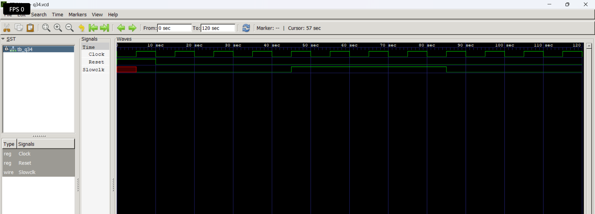

# Level 4 — Sequential Circuits

> **Part of:** [verilog-questions](../) — Verilog HDL learning from zero to FSM-based project  
> **Tools:** Icarus Verilog · GTKWave · VS Code  
> **Status:** 🔄 In Progress — Day 9 (Q26–Q34 done)

---

## What This Level Covers

Introducing **sequential logic** — circuits that can store information and update outputs only on clock edges.

Unlike combinational logic, sequential circuits remember previous values using flip-flops and registers.

DSA equivalent: Variables storing previous state, iterative updates, counters

Verilog equivalent: `always @(posedge clk)`, non-blocking assignments (`<=`), flip-flops, registers, counters, shift registers

### Three rules that never change in this level

- Sequential logic uses `always @(posedge clk)`
- Use non-blocking assignment (`<=`) inside clocked always blocks
- Outputs driven inside clocked always blocks must be declared as `reg`

---

## Progress

| # | File | What It Does | Status |
|---|------|-------------|--------|
| Q26 | `q26_dff.v` | D Flip-Flop | ✅ Done |
| Q27 | `q27_dffsync.v` | D Flip-Flop with Synchronous Reset | ✅ Done |
| Q28 | `q28_dffasync.v` | D Flip-Flop with Asynchronous Reset | ✅ Done |
| Q29 | `q29_register.v` | 4-bit Register | ✅ Done |
| Q30 | `q30_shiftreg.v` | 4-bit Shift Register | ✅ Done |
| Q31 | `q31_upcounter.v` | 4-bit Up Counter | ✅ Done |
| Q32 | `q32_updowncounter.v` | 4-bit Up-Down Counter | ✅ Done |
| Q33 | `q33_decade.v` | Decade Counter | ✅ Done |
| Q34 | `q34_clkdivider.v` | Clock Divider | ✅ Done |
| Q35 | `q35_piso.v` | PISO Shift Register | ⬜ Not Started |

---

## How to Run

```bash
iverilog -o output q26_dff.v tb_q26.v
vvp output
gtkwave q26.vcd
```

GTKWave is essential in this level because sequential circuits depend on **clock timing** rather than only input values.

Useful tips:

- Display multi-bit signals in Binary or Hex
- Observe **posedge clk**
- Compare input and output timing
- Predict waveforms before simulating

---

---

# Q34 - Clock Divider

## 📌 Aim
Design a **Clock Divider** in Verilog that generates a slower clock signal from a faster input clock by using a 2-bit counter.

---

## 📖 Theory

A Clock Divider reduces the frequency of an input clock by counting clock cycles and toggling an output signal after a fixed number of counts.

In this design:

- A **2-bit counter** counts from `0` to `3`.
- When the counter reaches `3`, it:
  - Resets back to `0`.
  - Toggles the output clock (`Slowclk`).
- This produces a clock signal with a lower frequency than the original input clock.

This concept is widely used in digital systems for generating slower clocks required by LEDs, displays, timers, communication protocols, and other peripherals.

---

## 🛠️ Components Used

- Sequential `always @(posedge Clock)` block
- 2-bit Register (Counter)
- Reset Logic
- Toggle Operation (`~Slowclk`)
- Non-blocking Assignments (`<=`)

---

## 💻 Verilog Code

```verilog
module q34 (
    input wire Clock,
    input wire Reset,
    output reg Slowclk
);

reg [1:0] Counter;

always @(posedge Clock) begin
    if (Reset) begin
        Counter <= 0;
        Slowclk <= 0;
    end
    else if (Counter == 3) begin
        Slowclk <= ~Slowclk;
        Counter <= 0;
    end
    else begin
        Counter <= Counter + 1;
    end
end

endmodule
```

---

## ▶️ Simulation

The simulation verifies:

- Reset initializes the circuit.
- Counter counts from `0` to `3`.
- Slow clock toggles after every four rising edges.
- Process repeats continuously.

---

## 🌊 Waveform

> 

Example:

```
Clock

_|‾|_|‾|_|‾|_|‾|_|‾|_|‾|_|‾|_|‾|_

Slowclk

___________|‾‾‾‾‾‾‾‾‾|____________
```

---

## 📚 Concepts Learned

- Clock Division
- Frequency Reduction
- Sequential Logic
- Counter-Based Design
- Toggle Logic
- Non-blocking Assignments
- Register Reset
- Digital Timing

---

## 🎯 Applications

- LED Blinking
- Digital Clocks
- Timers
- Frequency Division
- FPGA Clock Management (conceptual)
- Embedded Digital Systems

---

## ✅ Output

The output clock (`Slowclk`) toggles after every four input clock cycles, generating a slower clock signal from the original input clock.

---

## 📁 Files

```
q34.v
tb_q34.v
q34.vcd
README.md
```

---

## 🚀 Author

**Yash Gupta**

Learning Verilog HDL from scratch through hands-on digital design projects.

---

*Updated as questions are completed.*

**Next: Q35 — PISO**