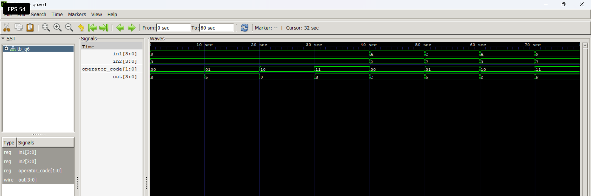

# Level 3 — Always Blocks and Combinational Logic

> **Part of:** [verilog-questions](../) — Verilog HDL learning from zero to FSM-based project  
> **Tools:** Icarus Verilog · GTKWave · VS Code  
> **Status:** 🔄 In Progress — Day 4 (Q19–Q24 done)

---

## What This Level Covers

Moving from `assign` statements to `always @(*)` blocks — a more powerful way to describe combinational logic using if/else and case statements.

DSA equivalent: If/else logic, switch/case, conditional expressions  
Verilog equivalent: always @(*), if/else, case inside hardware

**Two rules that never change in this level:**
- Outputs driven inside always blocks must be declared as `reg` not `wire`
- Use blocking assignment `=` inside always @(*) — never `<=`

---

## Progress

| # | File | What It Does | Status |
|---|------|-------------|--------|
| Q19 | `q19_mux2to1.v` | 2-to-1 Multiplexer using if/else | ✅ Done |
| Q20 | `q20_mux4to1.v` | 4-to-1 Multiplexer using case | ✅ Done |
| Q21 | `q21_priority.v` | Priority Encoder — highest active input | ✅ Done |
| Q22 | `q22_sevenseg.v` | 7-Segment Display Decoder | ✅ Done |
| Q23 | `q23_comparator.v` | 2-bit Comparator — gt, eq, lt outputs | ✅ Done |
| Q24 | `q24_alu.v` | 4-bit ALU — add, sub, AND, OR | ✅ Done |
| Q25 | `q25_barrel.v` | Barrel Shifter — shift left by N | ⬜ Not Started |

---

## How to Run

```bash
iverilog -o output q19_mux2to1.v q19_mux2to1_tb.v
vvp output
gtkwave dump.vcd
```

GTKWave is standard from Q20 onwards.
Right click signal → Data Format → Hex for multi-bit signals.
Right click signal → Data Format → Binary to see individual bit changes.

---
## Q24 — 4-bit ALU

**What it does:** Performs four different operations on two 4-bit inputs based on a 2-bit operator code.

**Real world use:** ALUs are the core computational units inside processors and microcontrollers. They perform arithmetic operations like addition and subtraction, as well as logical operations like AND and OR.

**Operator Table:**

| Operator Code | Operation | Expression |
|--------------|-----------|------------|
| `00` | Addition | `in1 + in2` |
| `01` | Subtraction | `in1 - in2` |
| `10` | Bitwise AND | `in1 & in2` |
| `11` | Bitwise OR | `in1 \| in2` |

**Code:**

```verilog
module q6 (
    input wire [3:0] in1,
    input wire [3:0] in2,
    input wire [1:0] operator_code,
    output reg [3:0] out
);

always @(*) begin
    case(operator_code)
        2'b00: out = in1 + in2;
        2'b01: out = in1 - in2;
        2'b10: out = in1 & in2;
        2'b11: out = in1 | in2;
        default: out = 4'b0000;
    endcase
end

endmodule
```

**Example Results:**

| `in1` | `in2` | Operator Code | Operation | `out` |
|------|------|---------------|-----------|------|
| `1000` | `0011` | `00` | Addition | `1011` |
| `1000` | `0011` | `01` | Subtraction | `0101` |
| `1000` | `0011` | `10` | Bitwise AND | `0000` |
| `1000` | `0011` | `11` | Bitwise OR | `1011` |

**Waveform:**



**What I learned:**

A 2-bit operator code can select between four different ALU operations because two bits provide four combinations: `00`, `01`, `10`, and `11`. A `case` statement is useful when one control signal selects between multiple operations. Arithmetic operators like `+` and `-` and bitwise operators like `&` and `|` can work directly on multi-bit vectors. Since `out` is assigned inside an `always @(*)` block, it must be declared as `reg`. The output is only 4 bits wide, so any carry beyond 4 bits during addition is discarded.

---

## Key Concepts So Far

| Concept | What It Means |
|---------|--------------|
| `always @(*)` | Runs whenever any input signal changes — combinational |
| `reg` output | Required for signals driven inside always blocks |
| `=` blocking | Used inside always @(*) — executes in order |
| `if/else` | Conditional logic — hardware selects between options |

---

*Updated as questions are completed*  
*Next: Q25 Barrel Shifter*