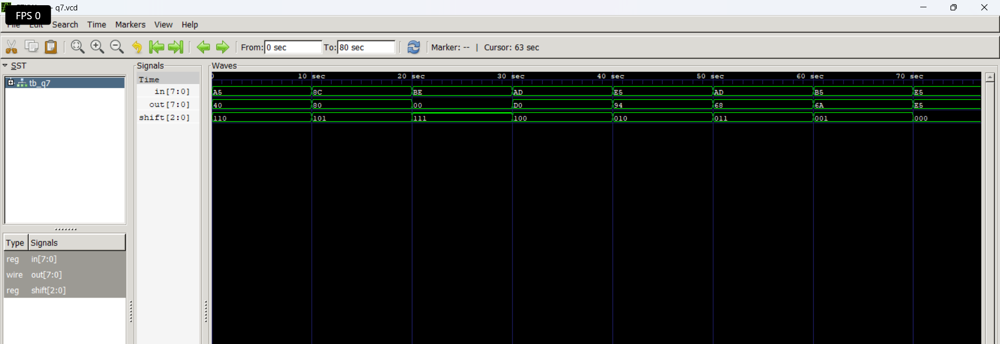

# Level 3 — Always Blocks and Combinational Logic

> **Part of:** [verilog-questions](../) — Verilog HDL learning from zero to FSM-based project  
> **Tools:** Icarus Verilog · GTKWave · VS Code  
> **Status:** ✅ Level 3 Complete — All 7 questions done

---

## What This Level Covers

Moving from `assign` statements to `always @(*)` blocks — a more powerful way to describe combinational logic using if/else and case statements.

DSA equivalent: If/else logic, switch/case, conditional expressions  
Verilog equivalent: always @(*), if/else, case inside hardware

**Two rules that never change in this level:**
- Outputs driven inside always blocks must be declared as `reg` not `wire`
- Use blocking assignment `=` inside always @(*) — never `<=`

---

## Progress

| # | File | What It Does | Status |
|---|------|-------------|--------|
| Q19 | `q19_mux2to1.v` | 2-to-1 Multiplexer using if/else | ✅ Done |
| Q20 | `q20_mux4to1.v` | 4-to-1 Multiplexer using case | ✅ Done |
| Q21 | `q21_priority.v` | Priority Encoder — highest active input | ✅ Done |
| Q22 | `q22_sevenseg.v` | 7-Segment Display Decoder | ✅ Done |
| Q23 | `q23_comparator.v` | 2-bit Comparator — gt, eq, lt outputs | ✅ Done |
| Q24 | `q24_alu.v` | 4-bit ALU — add, sub, AND, OR | ✅ Done |
| Q25 | `q25_barrel.v` | Barrel Shifter — shift left by N | ✅ Done |

---

## How to Run

```bash
iverilog -o output q19_mux2to1.v q19_mux2to1_tb.v
vvp output
gtkwave dump.vcd
```

GTKWave is standard from Q20 onwards.
Right click signal → Data Format → Hex for multi-bit signals.
Right click signal → Data Format → Binary to see individual bit changes.

---
Q25 — Barrel Shifter
What it does: Shifts an 8-bit input left by N positions where N is a 3-bit shift amount.
Real world use: Multiplication by powers of 2, bit manipulation in graphics processing, fast data alignment in communication systems.
Code:
verilogmodule q25_barrel(
    input  [7:0] in,
    input  [2:0] shift,
    output reg [7:0] out
);
    always @(*) begin
        case(shift)
            3'd0: out = in;
            3'd1: out = in << 1;
            3'd2: out = in << 2;
            3'd3: out = in << 3;
            3'd4: out = in << 4;
            3'd5: out = in << 5;
            3'd6: out = in << 6;
            3'd7: out = in << 7;
        endcase
    end
endmodule
Examples:
in      shift   out
00000001 000   00000001 
00000001 001   00000010 
00000001 011   00001000
00000001 111   10000000
11111111 001   11111110

---

**Waveform:**



**What I learned:**

<< is the left shift operator — shifting left by 1 is equivalent to multiplying by 2, shifting left by 2 is multiplying by 4. Bits shifted out from the left are lost and zeros fill in from the right. A barrel shifter can do any shift in one clock cycle — unlike a serial shifter that needs N clock cycles to shift by N positions.
---

Full Level 3 Summary
Concept                 What It Means
always @(*)             Runs whenever any input changes — combinational
reg output              Required for signals driven inside always blocks
= blocking              Used inside always @(*)
if/else                 Priority-based condition checking
case                    Direct value matching — cleaner for fixed options
default                 Handles unspecified case entries — prevents latches
Comparison operators    >, ==, < work directly on vectors
Arithmetic operators    +, - work on vectors, overflow silently dropped
<<                      Left shift operator — multiply by powers of 2

---

*Updated as questions are completed*  
*Level 3 Complete — Moving to [Level 4 — Sequential Circuits](../level4-sequential/README.md)*