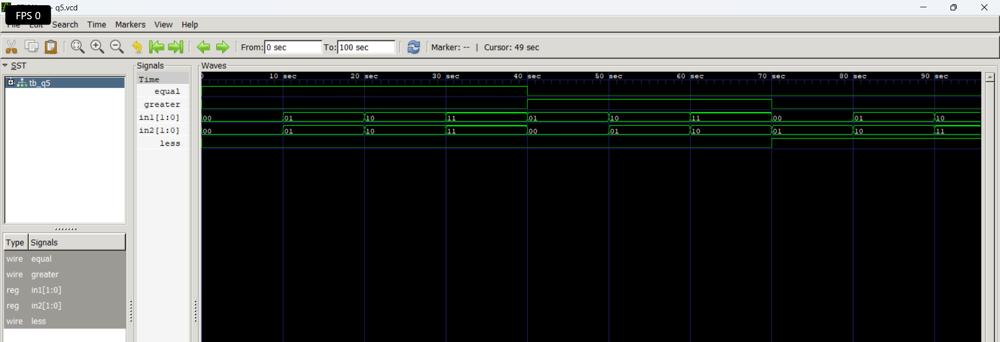

# Level 3 — Always Blocks and Combinational Logic

> **Part of:** [verilog-questions](../) — Verilog HDL learning from zero to FSM-based project  
> **Tools:** Icarus Verilog · GTKWave · VS Code  
> **Status:** 🔄 In Progress — Day 3 (Q19–Q23 done)

---

## What This Level Covers

Moving from `assign` statements to `always @(*)` blocks — a more powerful way to describe combinational logic using if/else and case statements.

DSA equivalent: If/else logic, switch/case, conditional expressions  
Verilog equivalent: always @(*), if/else, case inside hardware

**Two rules that never change in this level:**
- Outputs driven inside always blocks must be declared as `reg` not `wire`
- Use blocking assignment `=` inside always @(*) — never `<=`

---

## Progress

| # | File | What It Does | Status |
|---|------|-------------|--------|
| Q19 | `q19_mux2to1.v` | 2-to-1 Multiplexer using if/else | ✅ Done |
| Q20 | `q20_mux4to1.v` | 4-to-1 Multiplexer using case | ✅ Done |
| Q21 | `q21_priority.v` | Priority Encoder — highest active input | ✅ Done |
| Q22 | `q22_sevenseg.v` | 7-Segment Display Decoder | ✅ Done |
| Q23 | `q23_comparator.v` | 2-bit Comparator — gt, eq, lt outputs | ✅ Done |
| Q24 | `q24_alu.v` | 4-bit ALU — add, sub, AND, OR | ⬜ Not Started |
| Q25 | `q25_barrel.v` | Barrel Shifter — shift left by N | ⬜ Not Started |

---

## How to Run

```bash
iverilog -o output q19_mux2to1.v q19_mux2to1_tb.v
vvp output
gtkwave dump.vcd
```

GTKWave is standard from Q20 onwards.
Right click signal → Data Format → Hex for multi-bit signals.
Right click signal → Data Format → Binary to see individual bit changes.

---
Q23 — 2-bit Comparator
What it does: Compares two 2-bit inputs and outputs three signals — greater than, equal to, and less than.
Real world use: Address comparators in memory systems, condition checking in processors, range detection in control systems.
Code:
verilogmodule q23_comparator(
    input  [1:0] a,
    input  [1:0] b,
    output reg   gt,
    output reg   eq,
    output reg   lt
);
    always @(*) begin
        if (a > b) begin
            gt = 1; eq = 0; lt = 0;
        end else if (a == b) begin
            gt = 0; eq = 1; lt = 0;
        end else begin
            gt = 0; eq = 0; lt = 1;
        end
    end
endmodule
Truth Table:
a  b  gt eq lt
00 00 0  1  0
01 00 1  0  0
00 01 0  0  1
10 01 1  0  0
11 11 0  1  0
10 11 0  0  1


**Waveform:**




What I learned:
Verilog comparison operators >, ==, < work directly on vectors — no need to compare bit by bit manually. Only one of the three outputs is HIGH at any time — this is called mutually exclusive outputs. Setting all three explicitly in every branch avoids unintended latches which happen when an output is not assigned in some condition.

---

## Key Concepts So Far

| Concept | What It Means |
|---------|--------------|
| `always @(*)` | Runs whenever any input signal changes — combinational |
| `reg` output | Required for signals driven inside always blocks |
| `=` blocking | Used inside always @(*) — executes in order |
| `if/else` | Conditional logic — hardware selects between options |

---

*Updated as questions are completed*  
*Next: Q24 4-bit ALU*