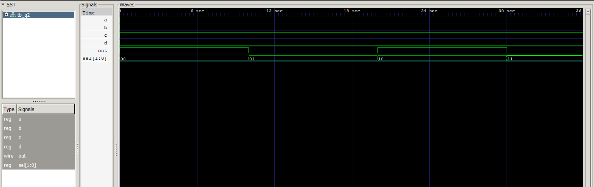

# Level 3 — Always Blocks and Combinational Logic

> **Part of:** [verilog-questions](../) — Verilog HDL learning from zero to FSM-based project  
> **Tools:** Icarus Verilog · GTKWave · VS Code  
> **Status:** 🔄 In Progress — Day 2 (Q19–Q20 done)

---

## What This Level Covers

Moving from `assign` statements to `always @(*)` blocks — a more powerful way to describe combinational logic using if/else and case statements.

DSA equivalent: If/else logic, switch/case, conditional expressions  
Verilog equivalent: always @(*), if/else, case inside hardware

**Two rules that never change in this level:**
- Outputs driven inside always blocks must be declared as `reg` not `wire`
- Use blocking assignment `=` inside always @(*) — never `<=`

---

## Progress

| # | File | What It Does | Status |
|---|------|-------------|--------|
| Q19 | `q19_mux2to1.v` | 2-to-1 Multiplexer using if/else | ✅ Done |
| Q20 | `q20_mux4to1.v` | 4-to-1 Multiplexer using case | ✅ Done |
| Q21 | `q21_priority.v` | Priority Encoder — highest active input | ⬜ Not Started |
| Q22 | `q22_sevenseg.v` | 7-Segment Display Decoder | ⬜ Not Started |
| Q23 | `q23_comparator.v` | 2-bit Comparator — gt, eq, lt outputs | ⬜ Not Started |
| Q24 | `q24_alu.v` | 4-bit ALU — add, sub, AND, OR | ⬜ Not Started |
| Q25 | `q25_barrel.v` | Barrel Shifter — shift left by N | ⬜ Not Started |

---

## How to Run

```bash
iverilog -o output q19_mux2to1.v q19_mux2to1_tb.v
vvp output
gtkwave dump.vcd
```

GTKWave is standard from Q20 onwards.
Right click signal → Data Format → Hex for multi-bit signals.
Right click signal → Data Format → Binary to see individual bit changes.

---
Q20 — 4-to-1 Multiplexer
What it does: Selects one of four inputs based on a 2-bit select signal.
Real world use: Data routing in processors, selecting between multiple data sources on a shared bus, instruction decoding.
Code:
verilogmodule q20_mux4to1(
    input       a, b, c, d,
    input  [1:0] sel,
    output reg   out
);
    always @(*) begin
        case(sel)
            2'b00: out = a;
            2'b01: out = b;
            2'b10: out = c;
            2'b11: out = d;
        endcase
    end
endmodule
Truth Table:
selout00a01b10c11d
Simulation output:
time=0  | sel=00 | out=a
time=10 | sel=01 | out=b
time=20 | sel=10 | out=c
time=30 | sel=11 | out=d

**Waveform:**




What I learned:
case is cleaner than if/else when you have multiple fixed conditions on the same signal. Unlike if/else which checks conditions in order, case directly matches the value — much easier to read with 4 or more options. I verified this using GTKWave — switching the select signal and watching the output change in the waveform made the multiplexer behaviour much clearer than terminal output alone.

---

## Key Concepts So Far

| Concept | What It Means |
|---------|--------------|
| `always @(*)` | Runs whenever any input signal changes — combinational |
| `reg` output | Required for signals driven inside always blocks |
| `=` blocking | Used inside always @(*) — executes in order |
| `if/else` | Conditional logic — hardware selects between options |

---

*Updated as questions are completed*  
*Next: Q21 Priority Encoder* 