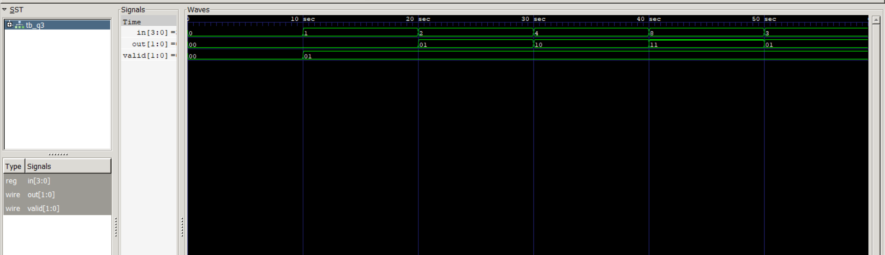

# Level 3 — Always Blocks and Combinational Logic

> **Part of:** [verilog-questions](../) — Verilog HDL learning from zero to FSM-based project  
> **Tools:** Icarus Verilog · GTKWave · VS Code  
> **Status:** 🔄 In Progress — Day 3 (Q19–Q21 done)

---

## What This Level Covers

Moving from `assign` statements to `always @(*)` blocks — a more powerful way to describe combinational logic using if/else and case statements.

DSA equivalent: If/else logic, switch/case, conditional expressions  
Verilog equivalent: always @(*), if/else, case inside hardware

**Two rules that never change in this level:**
- Outputs driven inside always blocks must be declared as `reg` not `wire`
- Use blocking assignment `=` inside always @(*) — never `<=`

---

## Progress

| # | File | What It Does | Status |
|---|------|-------------|--------|
| Q19 | `q19_mux2to1.v` | 2-to-1 Multiplexer using if/else | ✅ Done |
| Q20 | `q20_mux4to1.v` | 4-to-1 Multiplexer using case | ✅ Done |
| Q21 | `q21_priority.v` | Priority Encoder — highest active input | ✅ Done |
| Q22 | `q22_sevenseg.v` | 7-Segment Display Decoder | ⬜ Not Started |
| Q23 | `q23_comparator.v` | 2-bit Comparator — gt, eq, lt outputs | ⬜ Not Started |
| Q24 | `q24_alu.v` | 4-bit ALU — add, sub, AND, OR | ⬜ Not Started |
| Q25 | `q25_barrel.v` | Barrel Shifter — shift left by N | ⬜ Not Started |

---

## How to Run

```bash
iverilog -o output q19_mux2to1.v q19_mux2to1_tb.v
vvp output
gtkwave dump.vcd
```

GTKWave is standard from Q20 onwards.
Right click signal → Data Format → Hex for multi-bit signals.
Right click signal → Data Format → Binary to see individual bit changes.

---
Q21 — Priority Encoder
What it does: Takes a 4-bit input and outputs the index of the highest active bit. If multiple bits are HIGH, the highest index wins.
Real world use: Interrupt controllers in processors — when multiple devices request attention simultaneously, the highest priority device is served first.
Code:
verilogmodule q21_priority(
    input  [3:0] in,
    output reg [1:0] out,
    output reg valid
);
    always @(*) begin
        if (in[3]) begin
            out = 2'b11; valid = 1;
        end else if (in[2]) begin
            out = 2'b10; valid = 1;
        end else if (in[1]) begin
            out = 2'b01; valid = 1;
        end else if (in[0]) begin
            out = 2'b00; valid = 1;
        end else begin
            out = 2'b00; valid = 0;
        end
    end
endmodule
Truth Table:
in   out    valid
0000 00       0
0001 00       1
0010 01       1
0100 10       1
1000 11       1
1010 11       1
1111 11       1


**Waveform:**




What I learned:
Order of if/else matters here — checking in[3] first means it always wins over lower bits when multiple inputs are HIGH. This is what makes it a priority encoder, not just a regular encoder. The valid output tells downstream logic whether any input was active at all — without it you can't distinguish "no input" from "input 0 active."

---

## Key Concepts So Far

| Concept | What It Means |
|---------|--------------|
| `always @(*)` | Runs whenever any input signal changes — combinational |
| `reg` output | Required for signals driven inside always blocks |
| `=` blocking | Used inside always @(*) — executes in order |
| `if/else` | Conditional logic — hardware selects between options |

---

*Updated as questions are completed*  
*Next: Q22 7-Segment Display Decoder*